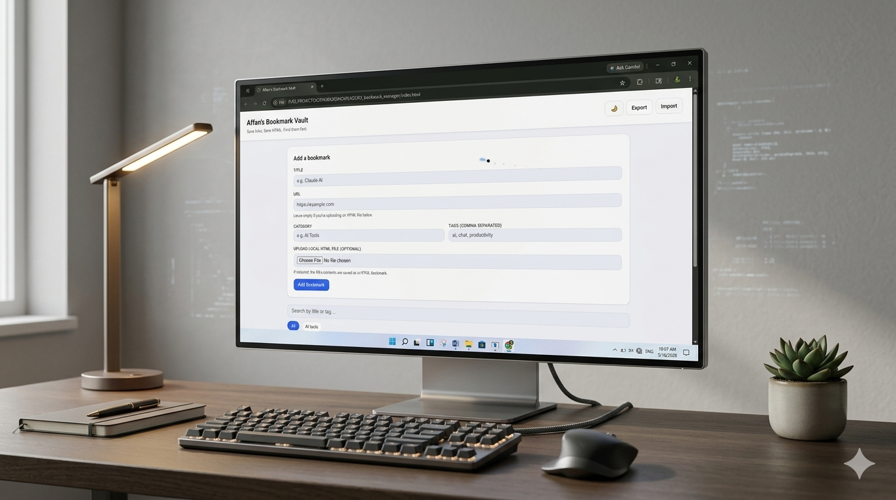
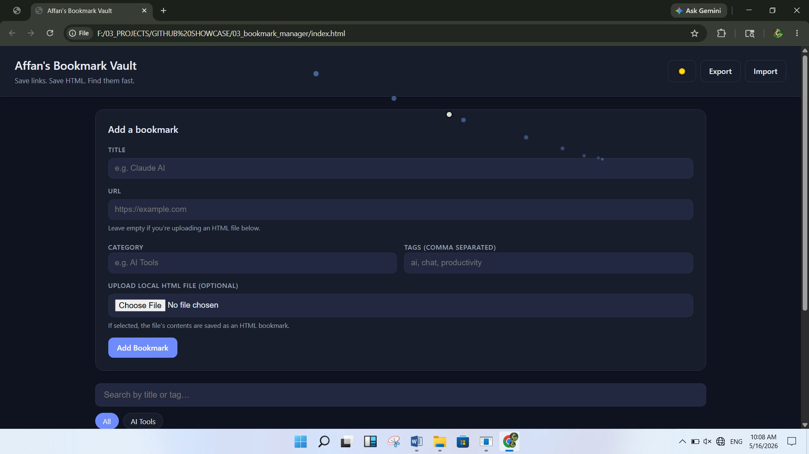
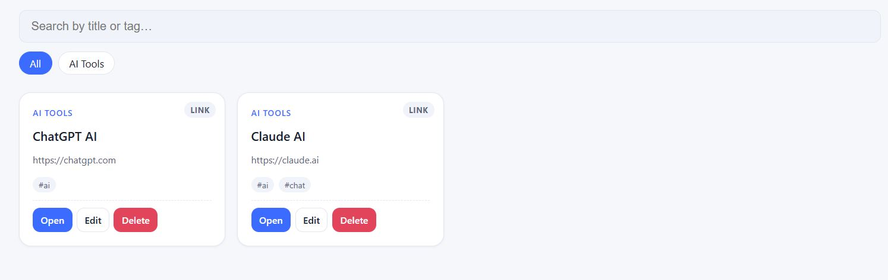

# ⚡ Affan's Bookmark Vault

<div align="center">

**A lightweight, privacy-first bookmark manager for modern power users**

*Save links. Save HTML. Find them fast.*

[](LICENSE)
[](https://html.spec.whatwg.org/)
[](https://www.w3.org/Style/CSS/)
[](https://www.javascript.com/)
[](https://developer.mozilla.org/en-US/docs/Web/API/Window/localStorage)
[](https://github.com)

</div>

---

## 📖 Description

**Affan's Bookmark Vault** is a lightweight, privacy-focused bookmarking application designed for developers, researchers, and power users. Store, organize, and retrieve web links and HTML files with zero external dependencies—everything runs locally in your browser. No accounts, no tracking, no data collection. Just pure, self-contained productivity.

---

## ✨ Features

- 🔗 **Dual-Mode Saving** — Save standard web links OR upload complete HTML files directly into your vault
- 🔒 **Client-Side Privacy** — All data persists via localStorage; no external databases, zero tracking
- 🏷️ **Advanced Organization** — Categorize bookmarks and assign searchable tags for perfect structure
- 📺 **HTML Previewer** — Safely view uploaded HTML content in a sandboxed environment
- 🌙 **Dark Mode** — Dynamic theme switching with persistent preference
- 🎨 **Modern UI/UX** — Responsive design with interactive cursor trail effects
- 📤 **Full Data Portability** — Export/import bookmarks as JSON for cross-browser synchronization
- ⚡ **Zero Dependencies** — Pure vanilla JavaScript—no frameworks, no bloat

---

## 📸 Screenshots

### Light Theme
<div align="center">



*Clean, minimal interface in light mode*

</div>

### Dark Theme & Functionality
<div align="center">



*Professional dark mode with full theming support*



*Smooth bookmark creation workflow*


*Modern interactive cursor effects*

</div>

---

## 🛠️ Tech Stack

This project is engineered for **maximum performance** and **zero external dependencies**:

| Layer | Technology |
|-------|-----------|
| **Frontend** | Semantic HTML5 + Modern CSS3 (CSS Variables for theming) |
| **Logic** | Vanilla JavaScript (ES6+) |
| **Storage** | LocalStorage API for persistent data |
| **File I/O** | FileReader & Blob APIs for HTML uploads |
| **Styling** | CSS3 Animations, Flexbox, Grid |

---

## 🚀 Getting Started

### Installation

```bash
# Clone the repository
git clone https://github.com/yourusername/bookmark-vault.git
cd bookmark-vault

# No dependencies to install! Open in browser
# Simply open index.html in your preferred browser
```

### Quick Start

1. **Open** `index.html` in your browser
2. **Add bookmarks** via the input form
3. **Organize** with categories and tags
4. **Export** your data anytime as JSON

---

## 💡 Usage Guide

### Adding Bookmarks

1. Enter a title and URL in the form
2. Optionally upload an HTML file instead
3. Assign a category and add tags
4. Click save—data persists instantly

### Organizing Your Vault

- **Categories** — Group related bookmarks by purpose
- **Tags** — Add multiple searchable keywords
- **Search** — Instantly filter by title, URL, tags, or category

### Managing Data

- **Export** — Download all bookmarks as a JSON file
- **Import** — Restore bookmarks from a JSON backup
- **Theme Toggle** — Switch between light/dark mode anytime

---

## 📂 Folder Structure

```
bookmark-vault/
├── index.html              # Entry point & layout
├── css/
│   └── style.css           # Theming, animations, responsive design
├── js/
│   ├── app.js              # Main orchestrator, event wiring
│   ├── bookmarkModel.js    # Business logic, search, data management
│   ├── ui.js               # Component rendering, modal management
│   ├── storage.js          # LocalStorage interface
│   └── fileHandler.js      # File I/O for HTML uploads & JSON
├── assets/
│   └── screenshots/        # UI showcase images
├── LICENSE                 # MIT License
└── README.md               # This file
```

---

## 🎯 Future Improvements

- 🔐 **End-to-End Encryption** — Optional password protection for sensitive bookmarks
- ☁️ **Cloud Sync** — Optional cross-device synchronization
- 📊 **Advanced Analytics** — Track most-used bookmarks and browsing patterns
- 🤖 **AI-Powered Tags** — Automatic tag suggestions based on content
- 🔍 **Full-Text Search** — Search within saved HTML content
- 🌐 **Browser Extension** — Quick-save from any webpage
- 📱 **Mobile App** — Native iOS/Android applications
- 🎨 **Custom Themes** — User-defined color schemes

---

## 📝 License

This project is licensed under the **MIT License** — see [LICENSE](LICENSE) for full details.

Copyright © 2026 [Affan Adil](https://github.com/yourusername)

---

## 👤 Author

<div align="center">

**Affan Adil**

[GitHub](https://github.com/yourusername) • [Portfolio](https://yourportfolio.com) • [Email](mailto:your.email@example.com)

*Building tools for developers, by developers.*

</div>

---

## 🤝 Contributing

Contributions are welcome! Please feel free to submit a Pull Request or open an Issue if you have suggestions or find bugs.

### How to Contribute

1. Fork the repository
2. Create your feature branch (`git checkout -b feature/AmazingFeature`)
3. Commit your changes (`git commit -m 'Add some AmazingFeature'`)
4. Push to the branch (`git push origin feature/AmazingFeature`)
5. Open a Pull Request

---

<div align="center">

**Made with ❤️ for the developer community**

⭐ If you find this useful, please consider starring the repository!

</div>
git clone https://github.com/affan675/03_bookmark_manager.git
Launch:
Open index.html in any modern web browser. No local server or environment setup is required.

🛡️ Security & Privacy
No Data Leaks: Your bookmarks and uploaded files never touch a server.

Iframe Sandboxing: Local HTML previews are rendered using the sandbox attribute to prevent script execution from interfering with the main application state.

Efficiency: Designed to be lightweight (~2MB safety cap on HTML files to stay within browser storage limits).

📄 License
This project is open-source and available under the MIT License.